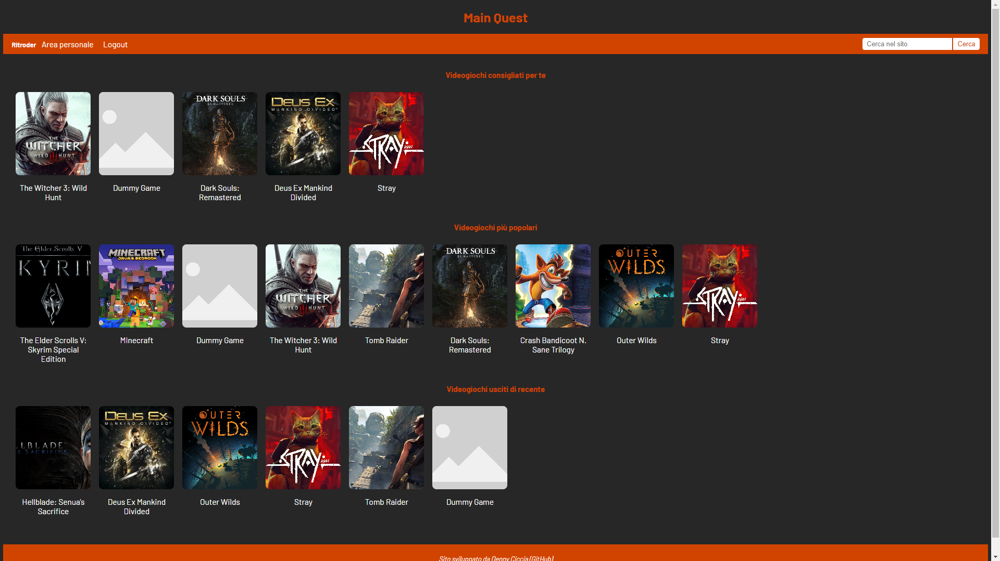
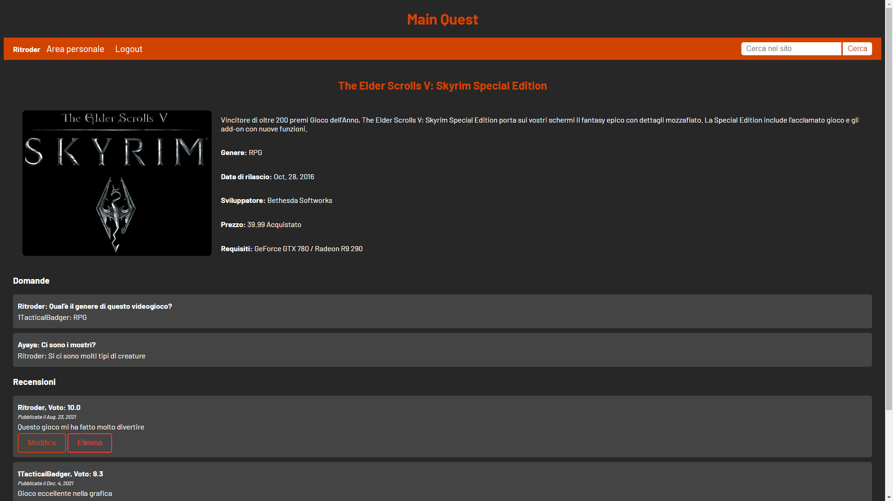
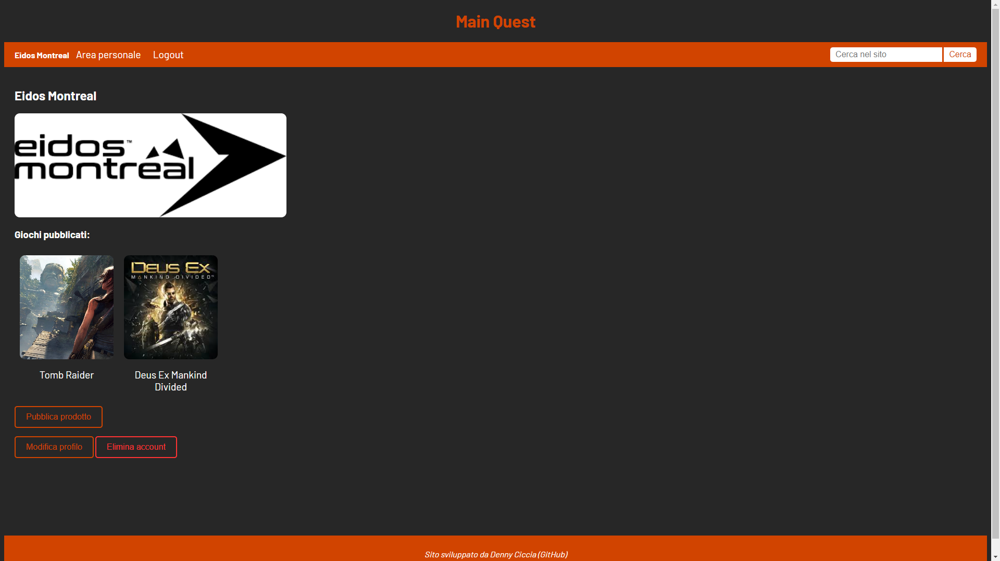
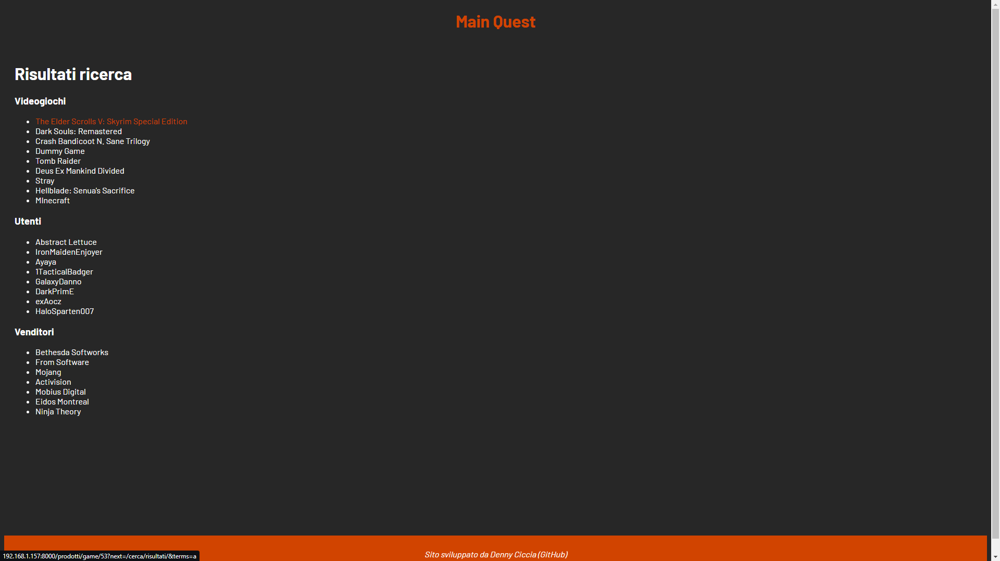

# Main Quest
Piccolo store di videogiochi fittizio realizzato per l'esame di Tecnologie Web

## Screenshot
 
 

## Istruzioni per l'avvio
Creare l'ambiente virtuale con pipenv e installare i requisiti. <br/>
Eseguire il comando `python manage.py runserver`.

## Requisiti
I requisiti del porgetto sono specificati nei file `Pipfile` e `Pipfile.lock`. <br/>
Per installarli eseguire il comando ```pipenv sync```.
